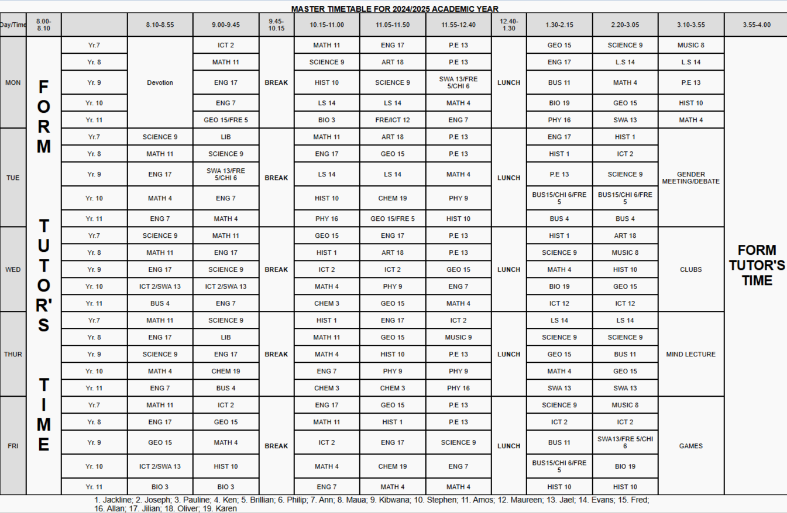

# Master Timetable for 2024/2025 Academic Year

This project is a fixed-layout school timetable built with HTML and CSS.

## How It Works

- The timetable is created using a CSS Grid layout (`.tt-container`), with each cell represented by a `
` and styled in `style.css`.
- Days, time slots, breaks, lunch, and activities are visually separated using grid columns and rows, with special classes for highlights (e.g., `.break-time`, `.lunch-time`).
- The timetable is centered and uses fixed widths for columns and rows to maintain clarity and match the sample.
- The bottom section lists student names, styled to align with the timetable.

## Accessibility

- The HTML uses semantic elements for headings and content.
- The timetable can be enhanced with ARIA roles or table headers for improved accessibility if required.
- The screenshot below includes descriptive alt text for screen readers.

## Validation

- The HTML and CSS files pass W3C validation with no errors.

## File Structure

- `index.html` — Main timetable structure
- `style.css` — All layout and styling rules
- `timetable_preview.png` — Screenshot of the timetable (see below)
- `README.md` — This documentation

## Screenshot

## Customization

- To change subjects, times, or names, edit the relevant `
`s in `index.html`.
- To adjust colors, fonts, or grid sizing, modify `style.css`.

## Author

Created by [Jeremiah Kinuthia].
